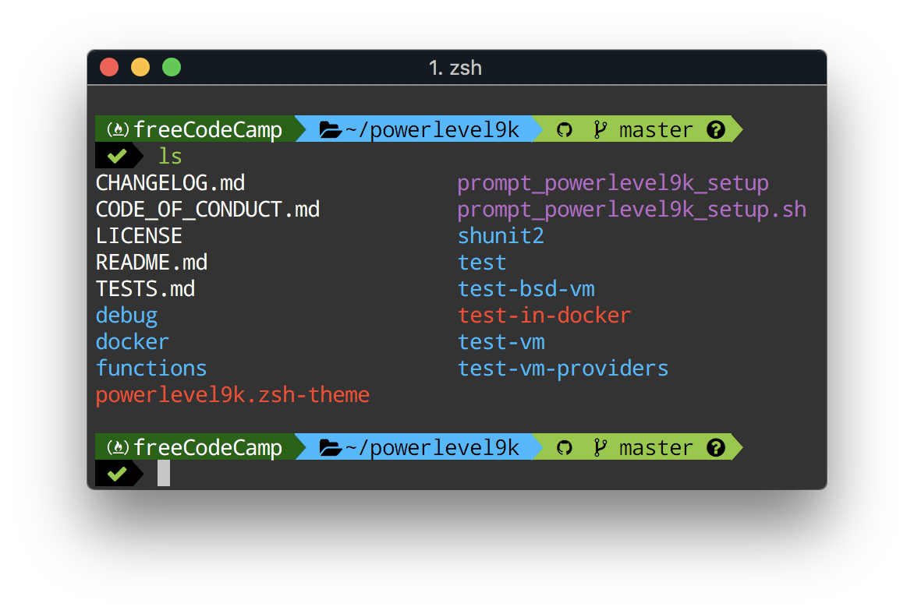
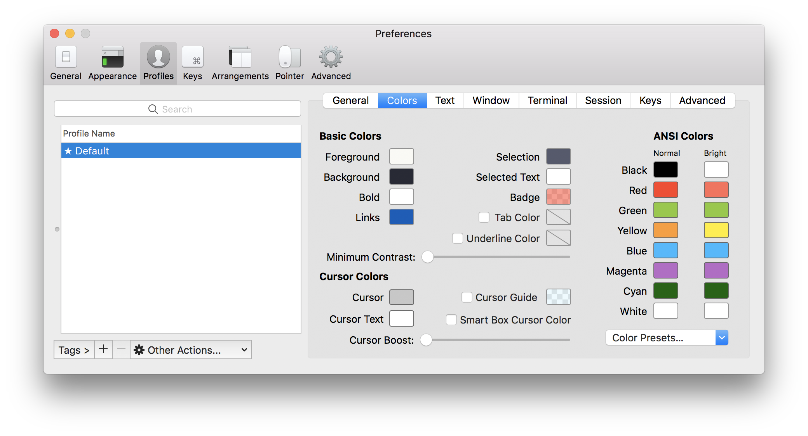

# powerlevel9k-freeCodeCamp
custom setup for Powerlevel9k for a freeCodeCamp theme



## Custom prompt segment

This adds the freeCodeCamp icon (from Nerd Fonts) along with the word freeCodeCamp as a segment in the terminal prompt

```
POWERLEVEL9K_CUSTOM_FREECODECAMP="echo -n $'\uE242' freeCodeCamp"
POWERLEVEL9K_CUSTOM_FREECODECAMP_BACKGROUND="cyan"
POWERLEVEL9K_CUSTOM_FREECODECAMP_FOREGROUND="white"
```

To use it you need to add this code to your `~/.zshrc`.

## Example .zshrc setup

```sh
# Customise the Powerlevel9k prompts
POWERLEVEL9K_LEFT_PROMPT_ELEMENTS=(custom_freecodecamp dir vcs newline status)
POWERLEVEL9K_RIGHT_PROMPT_ELEMENTS=()
POWERLEVEL9K_PROMPT_ADD_NEWLINE=true

# Add the custom freeCodeCamp promp segment
POWERLEVEL9K_CUSTOM_FREECODECAMP="echo -n $'\uE242' freeCodeCamp"
POWERLEVEL9K_CUSTOM_FREECODECAMP_FOREGROUND="white"
# Here we assign the background to another color, eg cyan
# because the ANSI green color setting is commonly used
# for other purposes
POWERLEVEL9K_CUSTOM_FREECODECAMP_BACKGROUND="cyan"

# Load Nerd Fonts with Powerlevel9k theme for Zsh
POWERLEVEL9K_MODE='nerdfont-complete'
source ~/powerlevel9k/powerlevel9k.zsh-theme
```

## Color scheme

Add the freeCodeCamp color scheme by downloading this repo (or just the [freeCodeCamp.itermcolors](freeCodeCamp.itermcolors) file).  

iTerm2 -> Preferences -> Profiles -> Colors -> import -> <YOUR LOCAL PATH TO FILE>freeCodeCamp.itermcolors  



## Further customisation

You can customise a color scheme yourself and save it by selecting the export option.  

[freeCodeCamp's design style guide](https://design-style-guide.freecodecamp.org/) has more on its brand colors, logo and typography

[iterm2colorschemes.com](https://iterm2colorschemes.com/) is a wide selection of color schemes for iTerm2
